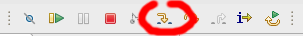
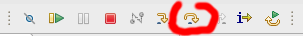

# Exercise 01 step 2 - Debugging Hello World

## Purpose of the exercise

To demonstrate how to start Hello World application in debug mode, how to step it, how to set a breakpoint.

## What you have to do

### Start the application in debug mode

1. Ensure that the board is connected to the PC.
2. In the SSv5 *Project Explorer* view, right-click the `01-HelloWord-step1` project.
3. Select **Debug As > Silicon Labs ARM Program**
4. SSv5 should ask you to switch to the *Debug* perspective. Accept.
4. SSv5 should display source code contained in `main.c`, and the first statement line after `main` definition should be highlighted. The statement should be a call to the `sl_system_init` function.

### Step into a function

Click on the *Step Into* tool to enter the `sl_system_init` code:

### Step Over a function call

Click on the *Step Over* tool to run the fisrt statement of the `sl_system_init` function, which is a call to `sl_platform_init`:

### Step a breakpoint

If `app.c` is not displayed in the editor view, open it (from the *Project Explorer* view).

Click the line with the `app_log("Hello World!\n");` statement. Then, **Run > Toggle Breakpoint**.

Now, resume the execution of the application, by clicking the *Resume* tool:

The execution stops at the line where the breakpoint was set.

## Other functions

There are many other functions available. You will discover most of them during the course.
