# Prerequisites

> [!NOTE]
> Instructions below are for a computer running version 21.2 of [Linux Mint](https://linuxmint.com/), a distribution based on Ubuntu. Additionally, notes provide some information for macOS. Thanks to [Laurent Toutain](https://github.com/ltn22) for them!

## Eclipse

Go to the [Eclipse Installer 2023‑03 R web page](https://www.eclipse.org/downloads/packages/release/2023-03/r) and click the download link corresponding to your computer. For instance:
* For a Linux computer with an Intel processor: select the *Linux x86_64* link
* For a MacBook with an M1 or M2 processor: select the *macOS AArch64* link

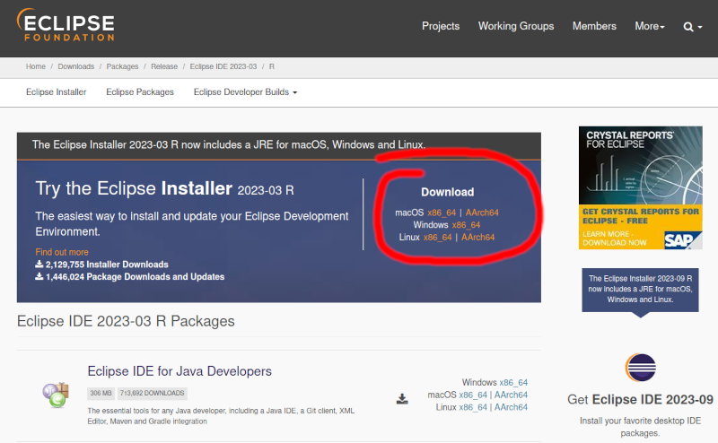

> [!IMPORTANT]
> The link above points to version 2023-03 of Eclipse Installer. Be sure to download this version.

Extract the contents of the downloaded file into a directory. For what follows, we consider that this directory is `~/DevTools`.

Run the `eclipse-inst` script:
```shell
$ ~/DevTools/eclipse-installer/eclipse-inst
```

The installer displays a list of Eclipse variants. Click the *Eclipse for C/C++ Developers* one:

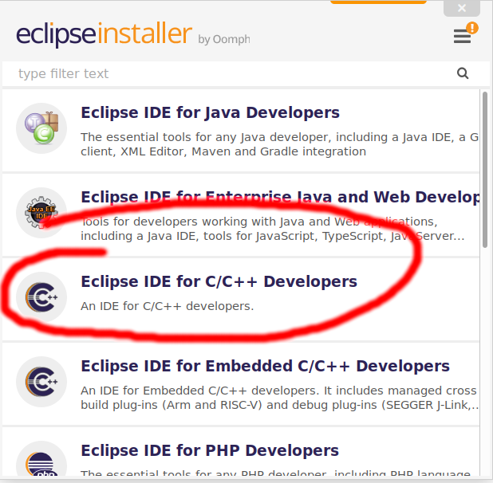

In the next window, keep the preselected JVM. You can adapt the installation folder in order to install Eclipse in the DevTools directory. Click the *INSTALL* button.

Accept the User Agreement.

At the end of the installation, don't launch Eclipse, and close the installer window.

> [!NOTE]
> For macOS, Eclipse Installer is delivered as a *dmg* file. You can specify the `~/DevTools` directory at installation time.
>
> The following warning window may be displayed:
>
> 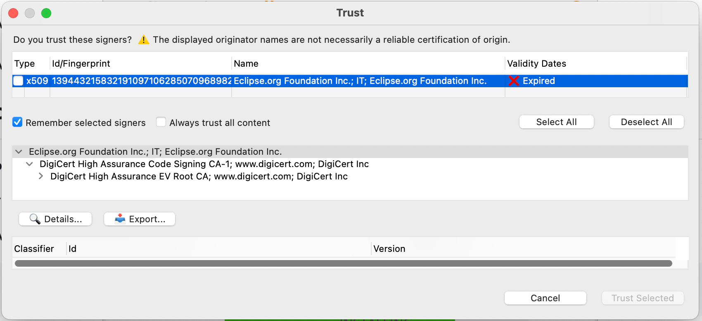
>
> Click *Select all* and then *Trust selected*.

## Python 

Python 3.6 or above is required. If it's not already installed on your computer, install it. With Linux Mint, Python 3.10 is already installed.

Additionally, ensure that the *venv* module and the *pip* installer are installed.
```shell
$ sudo apt install python3-venv python3-pip
```

Ensure that the `python` command runs Python 3. On Linux Mint:
```shell
$ sudo apt install python-is-python3
```

> [!NOTE]
>
> For macOS, you can do:
> ```shell
> $ brew install python3
> $ pip3 install virtualenv
> ```

## git

If *git* is not already installed, install it.

## ccache

*ccache* improves build time. It's recommended, but not mandatory. If you can/want, install it.

## IDF plugin

The Eclipse installation should have created an icon on the desktop, and/or a menu entry. Use them to start Eclipse.

> [!NOTE]
> On macOS, you'll find Eclipse in your applications.

A window displays a proposed directory for the Eclipse workspace. You can adapt it. For what follows, we will use `.../Dev/eclipse-workspace` instead of `.../eclipse-workspace`.

> [!NOTE]
> The workspace is the place where Eclipse stores information about the projects you will create.

Click the *Launch* button.

Minimize the *Welcome* tab by clicking the minimize icon:


Then, follow the instructions of the [*Installing IDF Plugin using update site URL* section](https://github.com/espressif/idf-eclipse-plugin#installing-idf-plugin-using-update-site-url) of the IDF plugin documentation, taking into account the following additional information:
* For the location of the repository, use the *Stable releases* link
* A *Trust* window asks whether you trust or not an unsigned content of unknown origin. Tick the related line, and click the *Trust selected* button:

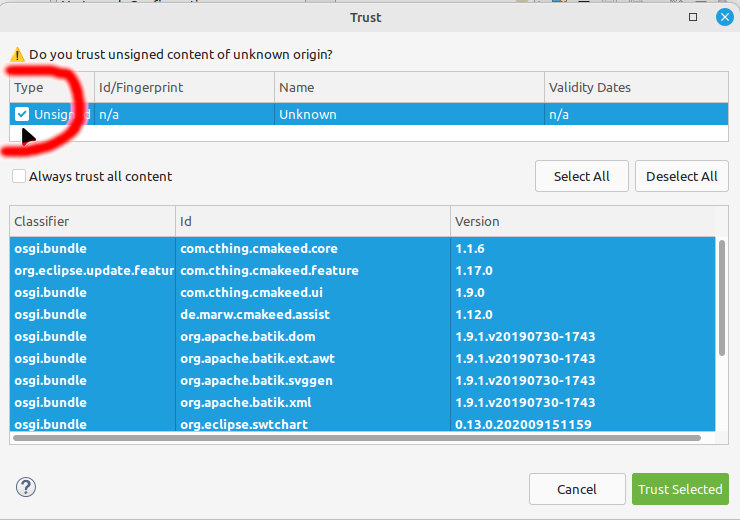

When you are asked for, restart Eclipse.

A new menu entry, *Espressif*, is displayed in the menu bar.

If the displayed Eclipse window is almost empty, click the *Restore* icon on the left hand side:

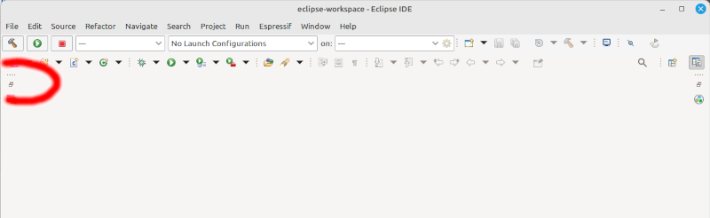

## ESP-IDF

Now, ESP-IDF has to be installed. Follow the instructions of the [*Installing ESP-IDF* section](https://github.com/espressif/idf-eclipse-plugin#installing-esp-idf) of the IDF plugin documentation, taking into account the following additional information:
* Replace the proposed version (5.1.2 or greater) of ESP-IDF by the 5.0.5 version
* Set directory where to download ESP-IDF to the `DevTools` subdirectory

A window informs you that the installation of a new set of tools could be required. Click the *Yes* button.

A new window is displayed, the *ESP-IDF Tools installation dialog*. Strangely, it may happen that it is hidden behind another window. So, if you can't see it, look for it.

The three displayed directory paths should be correct. Click the *Install Tools* button.

The console view displays a log of the installation. It may end with the following error message:
```
Unable to copy rules for OpenOCD to system directory, try running the eclipse with sudo command
```

If this is the case, run the copy command displayed just above by the error message, as sudo:
```shell
$ sudo cp <source-path>/60-openocd.rules /etc/udev/rules.d/60-openocd.rules
```

## Hello World!

Follow the instructions of the [*Create a new Project* section](https://github.com/espressif/idf-eclipse-plugin#create-a-new-project) of the IDF plugin documentation, taking into account the following additional information:
* Use `test01` for the project name
* After the project has been created, i.e. when the `README.md` file is displayed, select *esp32* as target, as presented below:

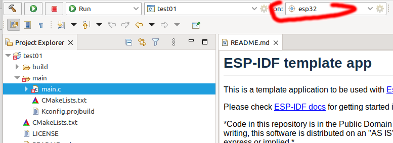

Click the build icon in the toolbar, to build the project:

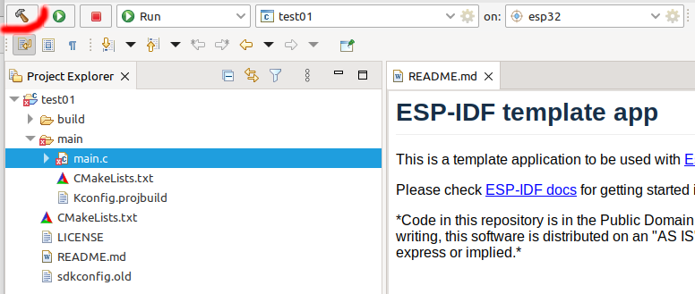

In the *Project Explorer* view, click on the small triangle on the left hand side of the *main* subdirectory of the *test01* project, and double-click the *main.c* file. This creates a new tab in the editor view, which displays the content of the file, and cancels errors which were reported after the build:

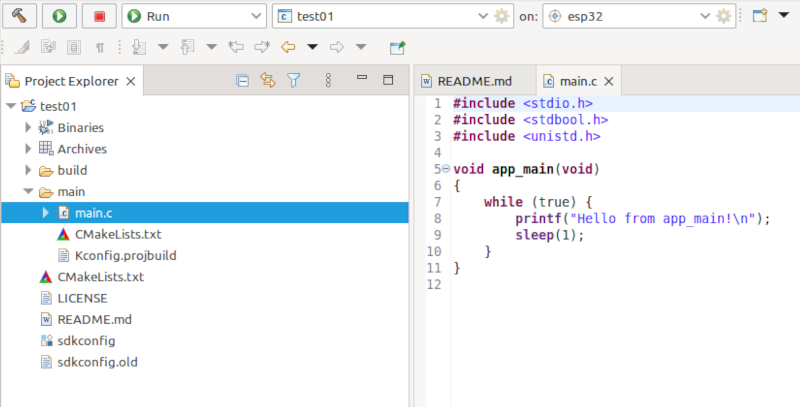

## Flash the ESP-EYE

Connect the ESP-EYE to a USB port of your computer.

Click the edition icon of the target:

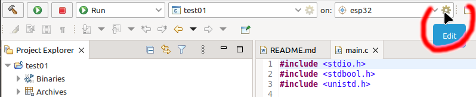

In the displayed window, select the (virtual) serial port corresponding to the USB port the ESP-EYE is connected to:

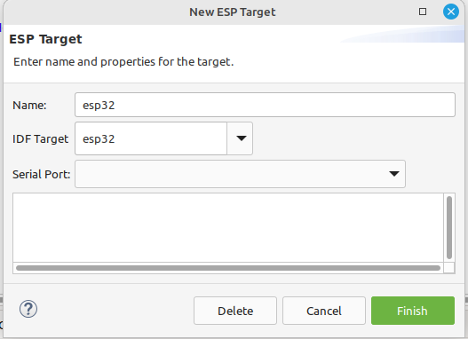

Its name should be something like */dev/ttyUSB0 CP2102N USB to UART Bridge Controller*. Once selected, a connection test is performed, and its result is displayed. It should be similar to this:

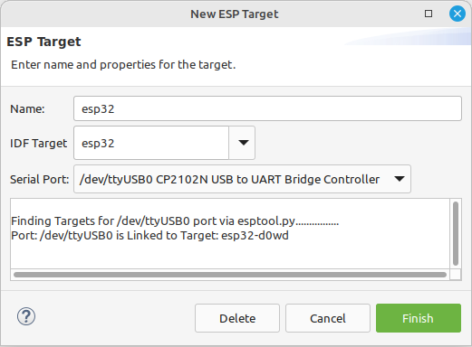

Click the *Finish* button of the window.

Click the launch icon in the toolbar, to flash the ESP-EYE with the application:

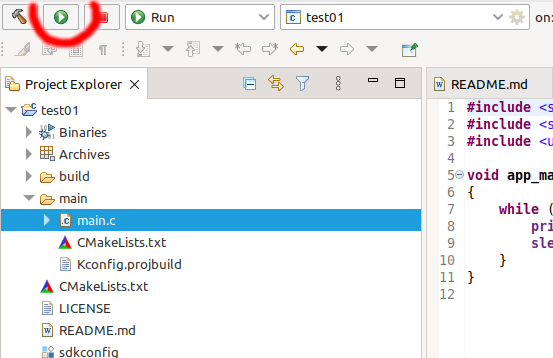

The console view should display log messages similar to the ones below:
```
Serial port /dev/ttyUSB0
Connecting......
Chip is ESP32-D0WD (revision v1.0)
Features: WiFi, BT, Dual Core, 240MHz, VRef calibration in efuse, Coding Scheme None
Crystal is 40MHz
MAC: e8:9f:6d:55:12:00
Uploading stub...
Running stub...
Stub running...
Changing baud rate to 460800
Changed.
Configuring flash size...
Flash will be erased from 0x00001000 to 0x00007fff...
Flash will be erased from 0x00010000 to 0x0003cfff...
Flash will be erased from 0x00008000 to 0x00008fff...
Compressed 26464 bytes to 16486...
Writing at 0x00001000... (50 %)
Writing at 0x000076d3... (100 %)
Wrote 26464 bytes (16486 compressed) at 0x00001000 in 0.7 seconds (effective 291.9 kbit/s)...
Hash of data verified.
Compressed 180640 bytes to 95320...
Writing at 0x00010000... (16 %)
Writing at 0x0001ba85... (33 %)
Writing at 0x00021372... (50 %)
Writing at 0x00026abf... (66 %)
Writing at 0x0002f56a... (83 %)
Writing at 0x00037254... (100 %)
Wrote 180640 bytes (95320 compressed) at 0x00010000 in 2.8 seconds (effective 521.9 kbit/s)...
Hash of data verified.
Compressed 3072 bytes to 103...
Writing at 0x00008000... (100 %)
Wrote 3072 bytes (103 compressed) at 0x00008000 in 0.1 seconds (effective 475.9 kbit/s)...
Hash of data verified.

Leaving...
Hard resetting via RTS pin...
Done
```

Click the terminal icon in the toolbar:

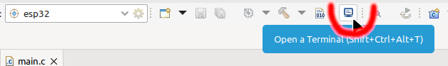

In the displayed *Launch Terminal* window, click the *OK* button.

The terminal view should now display a periodic message:
```
--- idf_monitor on /dev/ttyUSB0 115200 ---
--- Quit: Ctrl+] | Menu: Ctrl+T | Help: Ctrl+T followed by Ctrl+H ---
Hello from app_main!
Hello from app_main!
Hello from app_main!
Hello from app_main!
Hello from app_main!
Hello from app_main!
Hello from app_main!
```

If you have successfully reached this step, you're done with the installation of the development environment. You can unplug the ESP-EYE and wait for the first course session with confidence &#x1F642;

## Clone the repository

With git, clone the repository on your computer, for instance in a directory named `Dev`:
```shell
$ mkdir ~/Dev
$ cd ~/Dev
$ git clone git@github.com:PascalBod/IMTAtlantique-2024.git
```

## Command line tools (optional)

The IDF plugin allows to perform all usual development actions from Eclipse.

Some very specific actions may require to use the command line. On Linux, the following additional configuration  has to be done, in order to be able to use the command line:

* Enter the ESP-IDF directory:
```shell
$ cd ~/DevTools/esp-idf-v5.0.5
```
* Add the *execute* mode to some files:
```shell
$ chmod +x *.sh
$ chmod +x tools/*.sh
$ chmod +x tools/*.py
```
* Before running a tool, set up the environment:
```shell
$ . ~/DevTools/esp-idf-v5.0.5/export.sh
```